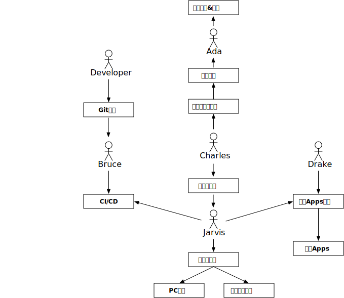

# Ada Render Sample

This is a `markdown` file.

```go
package main

import (
	"context"
	"fmt"
	"io/ioutil"

	"github.com/zhs007/adacore"
	adacorepb "github.com/zhs007/adacore/proto"
)

func genMarkdown() string {
	km, err := adacore.LoadKeywordMappingList("./keywordmapping.yaml")
	if err != nil {
		fmt.Printf("load keywordmapping error %v", err)
	}

	md := adacore.NewMakrdown("Ada Core")

	md.AppendParagraph("This is a Markdown API for Ada.")
	md.AppendParagraph("This libraray is write by Zerro.\nThis is a multi-line text.")

	md.AppendTable([]string{"head0", "head1", "head2"}, [][]string{
		[]string{"text0_0", "text1_0", "text2_0"},
		[]string{"text0_1", "text1_1", "text2_1"}})

	fd, err := ioutil.ReadFile("./main.go")
	if err != nil {
		return ""
	}

	md.AppendCode(string(fd), "golang")

	return md.GetMarkdownString(km)
}

func startClient(cfg *adacore.Config) error {
	client := adacore.NewClient("47.91.209.141:7201", "x7sSGGHgmKwUMoa5S4VZlr9bUF2lCCzF")

	reply, err := client.BuildWithMarkdown(context.Background(), &adacorepb.MarkdownData{
		StrData:      genMarkdown(),
		TemplateName: "default",
	})
	if err != nil {
		fmt.Printf("startClient BuildWithMarkdownFile %v", err)

		return err
	}

	if reply != nil {
		// fmt.Print(reply.HashName)
		fmt.Print(reply.Url)
	}

	return nil
}

func main() {
	cfg, err := adacore.LoadConfig("./config.yaml")
	if err != nil {
		fmt.Printf("startServ LoadConfig %v", err)

		return
	}

	adacore.InitLogger(cfg)

	startClient(cfg)
}
```

This is a `markdown` file.  
This a multiline string.


This is a `markdown` file.  
This a multiline string too.

```ada.dataset
name: testdata
data:
  namedata: ['a', 'b', 'c', 'd', 'e']
  valdata: [[5, 4, 3, 2, 1]]
  multivaldata: [[5, 4, 3, 2, 1],[6, 5, 4, 3, 2],[7, 6, 5, 4, 3],[8, 7, 6, 5, 4],[9, 8, 7, 6, 5],[10, 9, 8, 7, 6]]
```

```ada.table2
 id: testtable2
 datasetname: testdata
 tablehead: namedata
 tablebody: valdata

```

-=I am center text.=-

```ada.table2
 id: testtable3
 datasetname: testdata
 tablehead: namedata
 tablebody: multivaldata

```

$$ada.emptyline$$
$$ada.emptyline$$

| name | 111 | 222 | 333 | 444 |
| ---- | :-: | :-: | :-: | --: |
| aaa  | bbb | ccc | ddd | eee |
| fff  | ggg | hhh | iii | 000 |

```ada.pie
id: pie001
datasetname: testdata
title: Pie
width: 1280
height: 800
subtext: this is a test pie
a: pie name
bval: namedata
cval: valdata
sort: sort
```

```ada.line
id: line001
datasetname: testdata
title: Line
width: 1280
height: 800
subtext: this is a test line
xtype: category
xdata: namedata
ytype: value
ydata:
  - name: val1
    data: valdata
```

```ada.bar
id: bar001
datasetname: testdata
title: Bar
width: 1280
height: 800
subtext: this is a test bar
legenddata: ["val1"]
xtype: category
xshowall: true
xdata: namedata
ytype: value
ydata:
  - name: val1
    data: valdata
```

$$ada.bar$$
id: bar002
datasetname: testdata
title: Bar
width: 1280
height: 800
subtext: this is a test bar
legenddata: ["val1"]
xtype: category
xshowall: true
xdata: namedata
ytype: value
ydata:

- name: val1
  data: valdata
  $$ada.bar$$

```ada.treemap
id: treemap001
datasetname: testdata
title: Treemap
width: 1280
height: 800
recounttype: average
subtext: this is a test treemap
legenddata:
- test1
treemap:
- name: test1
  data:
  - name: nodeA
    children:
    - name: nodeAa
      value: 4
      url: https://www.google.com
    - name: nodeAb
      value: 6
  - name: nodeB
    children:
    - name: nodeBa
      value: 1
      children:
      - name: nodeBa1
        value: 20
```

```ada.sunburst
id: sunburst001
datasetname: testdata
title: Sunburst
width: 1280
height: 800
recounttype: sum
subtext: this is a test sunburst
legenddata:
- test1
treemap:
- name: category
  data:
    - name: Jackets
      value: 1042
      url: ""
      children:
      - name: Down Jackets
        value: 110
        url: ""
        children: []
      - name: One-Piece Snowsuits
        value: 4
        url: ""
        children: []
      - name: Technical Shells
        value: 65
        url: ""
        children: []
      - name: Ski & Snowboard Jackets
        value: 149
        url: ""
        children:
        - name: Ski Jackets
          value: 117
          url: ""
          children: []
        - name: 3-in-1 Jackets
          value: 17
          url: ""
          children: []
        - name: Snowboard Jackets
          value: 15
          url: ""
          children: []
      - name: Synthetic Insulation Jackets
        value: 167
        url: ""
        children: []
      - name: Fishing Jackets
        value: 8
        url: ""
        children: []
      - name: Softshell Jackets
        value: 45
        url: ""
        children: []
      - name: Rain Jackets
        value: 79
        url: ""
        children: []
      - name: Casual Jackets
        value: 86
        url: ""
        children: []
      - name: Fleece Jackets
        value: 185
        url: ""
        children: []
      - name: Wind Shells
        value: 61
        url: ""
        children: []
      - name: Performance Jackets
        value: 11
        url: ""
        children: []
      - name: Vests
        value: 71
        url: ""
        children: []
      - name: Performance Vests
        value: 1
        url: ""
        children: []
```

```ada.treemap
id: restreemap
title: 资源大小分布
subtext: ""
width: 800
height: 600
recounttype: sum
legenddata:
- http://47.90.46.159:8090
- http://at.alicdn.com
- https://dtresource.phtdreamtech.com
treemap:
- name: http://47.90.46.159:8090
  data:
  - name: html
    value: 0
    children:
    - name: game.html
      value: 16289
      children: []
  - name: css
    value: 0
    children:
    - name: index.css
      value: 4217
      children: []
  - name: json
    value: 0
    children:
    - name: gametrial
      value: 1326
      children: []
  - name: js
    value: 0
    children:
    - name: setbtn.js
      value: 3953
      children: []
    - name: nowdebug.js
      value: 22556
      children: []
- name: http://at.alicdn.com
  data:
  - name: css
    value: 0
    children:
    - name: font_908809_yescakidb6b.css
      value: 3081
      children: []
- name: https://dtresource.phtdreamtech.com
  data:
  - name: js
    value: 0
    children:
    - name: protobuf.min.js
      value: 20834
      children: []
    - name: dtsdk.js
      value: 156096
      children: []
    - name: base.min.js
      value: 1451649
      children: []
    - name: common.min.js
      value: 372963
      children: []
    - name: game1.min.js
      value: 256812
      children: []
  - name: json
    value: 0
    children:
    - name: project.json
      value: 136
      children: []
    - name: resource.json
      value: 6278
      children: []
    - name: resource.json
      value: 6013
      children: []
    - name: jackpot_layer_Fr4lLgWd46l1FAv6c1QcVL4QGMDA.json
      value: 18220
      children: []
    - name: jackpot_ani_FqFFJgnqIzaGORZNvV_me3__tPTU.json
      value: 93024
      children: []
    - name: jackpot_aninotice_FrE_sP9CYTCHVb191DuMsWYd7gBe.json
      value: 3675
      children: []
    - name: jackpot_list_FmFTjW-d7aff52Q-oyRfGLdAF1bm.json
      value: 36249
      children: []
    - name: jackpot_game_FsjHqZMNSofZDB_QR6sY0c6BXuqD.json
      value: 68368
      children: []
    - name: menubar_layer_FnnXwC8cpgDilG4nul-b3WnjTcd9.json
      value: 25314
      children: []
    - name: gameitem_Fhogxxl4kymQV6rmC-6nM59Wk_0c.json
      value: 4754
      children: []
    - name: menubar_setup_FqwxexuqvBziqwTuQygIXiVdLTxv.json
      value: 104632
      children: []
    - name: menubar_soundtips_FrHp0qeNPzgu597k2THbtFw2x3j2.json
      value: 7217
      children: []
    - name: menubar_usernotice_FsRlti5hDp0fCoTEwytlkJk70YVl.json
      value: 14041
      children: []
    - name: menubar_dlg_Fqh2_oilSumP4VjMWt3FJ4jhzcwT.json
      value: 9412
      children: []
    - name: menubar_dlg1_FiEX1Y_Vf54hUXWeSFPx_LOAbW_g.json
      value: 12318
      children: []
    - name: menubar_autodlg_Ftjjjl0xPviwEw-KDKmWfKjHqyHF.json
      value: 27107
      children: []
    - name: giftgame_new_layer_Fl2AuAMnpVCAW0U7b-xhzKbpgNoi.json
      value: 190524
      children: []
    - name: giftgame_new_layer1_FufTi4bnKycfVklwxHrCAbhWFDPp.json
      value: 201448
      children: []
    - name: giftrain_new_layer_FuszGmzn9RMWRcQhcJhsAfKjgs25.json
      value: 170621
      children: []
    - name: RPNotice_FkYX4ad-3aFSussEuth7fkgtmZ_Q.json
      value: 24876
      children: []
    - name: string_FqtiKxWUYULAdsp7mVZBmtdnLSUf.json
      value: 12385
      children: []
    - name: dbzgamelayer_FtUqj9AP1TsjAY7mLpHNmv-wddXc.json
      value: 77817
      children: []
    - name: dbzselectautolayer_Ft_ZGPGJboJnvm_KOVb8IeFC9-Eh.json
      value: 141588
      children: []
    - name: dbzfreeresultlayer_FkYGkPtcZr76Ajan_E412vr4yKWN.json
      value: 112190
      children: []
    - name: dbzdisconnectlayer_FhGdQDUoMksIdyaE6MsXZguJ1S5x.json
      value: 18398
      children: []
    - name: dbzhelplayer1_FhFN53RTT5ds3p9vXw79psDWRFRj.json
      value: 26126
      children: []
    - name: dbzhelplayer2_Fvcn-VyzllNw1h9tUcQHF2Rxg4rf.json
      value: 123841
      children: []
    - name: dbzhelplayer3_Ft7Bu6ZwWfM7qHlm1G-9YbcBL4Y-.json
      value: 139437
      children: []
    - name: dbzsetuplayer_FqC1J0u8m0RVC2aArC18EHa5gDzl.json
      value: 10024
      children: []
    - name: dbzsoundtipslayer_FoSkDzoB8H66geOiuWcyJvPdJHCZ.json
      value: 7124
      children: []
    - name: dbzgamebackani1_Fmwv504lxf3KoqKuhwTlam1F6GWl.json
      value: 37421
      children: []
    - name: dbzgamebackani2_Fg-o9FDTWIYT3nW-wh2JaOzOgX3k.json
      value: 24438
      children: []
    - name: dbzgamebackani3_FhqhKs0URDdpHiSt0nhJrc9_Th_s.json
      value: 11024
      children: []
    - name: dbzdownani1_FseGnjMUepYaJG5xXp1lj6JSWr8_.json
      value: 5629
      children: []
    - name: dbzdownani2_Fryr9MW2iRD65BNQO_olXgcnM2SH.json
      value: 5633
      children: []
    - name: dbzappearani0_FttLTcasJjVRajSuxJIoIpgeQO1Y.json
      value: 16748
      children: []
    - name: dbzappearani1_FvDTXXpGcAD3RZ_nVpzvNRENucqv.json
      value: 19771
      children: []
    - name: dbzappearani2_Fp74C8Reo3d1H58B5EC4LvaUvxP0.json
      value: 20424
      children: []
    - name: dbzdisappearani_Fq3OxPZ_Tj_3q_FWhYk30hy6Shup.json
      value: 125506
      children: []
    - name: dbzendani_FpxLJn-aya2FfBzl36Abri-W_GAL.json
      value: 18282
      children: []
    - name: dbzendani2_Fm5BM-eFeLQD4hL_zGH2aO-ZnXkm.json
      value: 20116
      children: []
    - name: dbzbeginani_FnmGl3Rq4eoU2ZtLIKFEJ_JWGV8M.json
      value: 103703
      children: []
    - name: dbzfreebackani_FipFID1FwA-5fiZLrC68GogLNBx5.json
      value: 100946
      children: []
    - name: dbzfightani1_Fhtw9zlsF1WvLMbcesyLg4kp61Zt.json
      value: 12744
      children: []
    - name: dbzfightani2_Fl4gem9UPmsQLVuQmvRsfpahmUKJ.json
      value: 32638
      children: []
    - name: dbzfightani3_Fo6jbnH1-QWNUDn3HNUXxPgoFjQl.json
      value: 26451
      children: []
    - name: dbzfightani4_FjuVyL-COJ3cas2Q6HD7ofhJLt0-.json
      value: 27233
      children: []
    - name: dbzfightani5_Fi2nk_rEZQs4M_rUGPPsTt0PV4kX.json
      value: 27251
      children: []
    - name: dbzfightani6_Fk4UrjM0sXUldcmRvubeRDXOQHzU.json
      value: 27233
      children: []
    - name: dbzfightani7_Fut0RI-22JS2-MzhwiR9iLv2KA-o.json
      value: 20816
      children: []
    - name: dbzfightani8_FmYvTApfsHME7egdJin6THm-SWfN.json
      value: 401171
      children: []
    - name: dbzfightani9_Fgu064y6S3XiFTeW2Iz_3KWysN7b.json
      value: 12726
      children: []
    - name: dbzfightani10_FlWJsgUVn9rnMvSUJTFkVgGYxtyp.json
      value: 32637
      children: []
    - name: dbzfightani11_FvUjAkF3ODKM55tlpS6EHy3CYzYv.json
      value: 26414
      children: []
    - name: dbzfightani12_FgNzZBiVNesuHbQxbWAVHM-zxo9M.json
      value: 27196
      children: []
    - name: dbzfightani13_FgFUpmTCpKbAEOlWfDnf18WJwdu4.json
      value: 27214
      children: []
    - name: dbzfightani14_FhghkwSRZVDnuWBh9M_HWdHkk5CQ.json
      value: 27234
      children: []
    - name: dbzfightani15_FkkwNnDlCAN7JmMHkbBx9QMJNni4.json
      value: 20838
      children: []
    - name: dbzfightani16_FjBGnNzoZ4_VtRpGqmJAUL9OurgH.json
      value: 13062
      children: []
    - name: dbzfightani17_FrN7vWxHsXH_eMTjiClhESgkAFOQ.json
      value: 122593
      children: []
    - name: dbzfightani18_Fi27uKSzbzX99INB3p8lPV26xWPD.json
      value: 122661
      children: []
    - name: dbzfightani19_Fnfjth5p_4G6Y1k26xbTkLoCQSgn.json
      value: 56064
      children: []
    - name: dbzfightani20_FsXTiLTSAPftBxEA5IzK8ahM6Kls.json
      value: 13062
      children: []
    - name: dbzfightani21_FqpdByMOa83Iiy2nvij5ira-m4wo.json
      value: 13062
      children: []
    - name: dbzfightani22_Flg0swBAchz72aLefqDziCfsC5Kb.json
      value: 122644
      children: []
    - name: dbzfightani23_Fhw82dts_W8xGifpm6R-UpsDP-SZ.json
      value: 122602
      children: []
    - name: dbzfightani24_FlJzP-hSXdI3bpEKYCk7vvrBLrVk.json
      value: 56131
      children: []
    - name: dbzfightani25_FkP9weTGWWNY4gpG3Psgnif-lv7G.json
      value: 13032
      children: []
    - name: dbzfightani26_FoiOSKL9uYZQLwwkBojW5gguKtRE.json
      value: 112408
      children: []
    - name: dbzfreeresultani1_FjIdFq9fozF1B6DutIqVAkm2uvPA.json
      value: 9391
      children: []
    - name: dbzfreeresultani2_FkFEo3MCp5ZJkkvQcWANXzOpL5wJ.json
      value: 87342
      children: []
    - name: dbzfreeresultani3_Fo7n7uhCkpvr6_9JPaGHWcPbHYMo.json
      value: 8094
      children: []
    - name: dbzaddfreeani_FmBYdJwDS500aoGB3xO-FmOVZBnT.json
      value: 32524
      children: []
    - name: dbzwinani1_Fmoqg14wNR2RzzVHm2SzW1bR_a-B.json
      value: 309655
      children: []
    - name: dbzwinani2_Fm-ipfuYhXVChxZW8-XGaF8fEjft.json
      value: 190425
      children: []
    - name: dbzwinani3_Frw0nkjtPvwlGgNe3QB877FgUzrF.json
      value: 93495
      children: []
    - name: dbzhitsani_FuLikOix1IE_9w9eOIsJj4HpQCKu.json
      value: 34855
      children: []
  - name: xml
    value: 0
    children:
    - name: jackpot_png_Fo_F5YpYSFPFyU-RxnO4rDvo5BUI.plist
      value: 13215
      children: []
    - name: menubar_png_FsIofCeh7uREps8PVEs3YFKhzv6Y.plist
      value: 29110
      children: []
    - name: giftgame_new_png_FsoRXcYYB6mLyhMY5sZRJVSxdIvP.plist
      value: 21510
      children: []
    - name: dbzpngres_FjHUTwjoPfgRtUnV3iSKZgWY5OHw.plist
      value: 68618
      children: []
    - name: dbzjpgres_Fsp4H60CvAnkZCg4tPUCh9G_UXr9.plist
      value: 7016
      children: []
    - name: dbzanipng_FrqwBkyQ4VK4B-VA0GCv0CewVbmn.plist
      value: 51102
      children: []
    - name: dbzanijpg_Fgc01sxjzTfrImFkIaU6O0sM-Io8.plist
      value: 5522
      children: []
  - name: octet-stream
    value: 0
    children:
    - name: giftgame_jpg_FhNlzm9yMplR7PmQDNKlaUzUW6Di.plist
      value: 3887
      children: []
    - name: jackpot_FtWKPrrkFREWlI60w2U-eD3SbnmU.ExportJson
      value: 106133
      children: []
    - name: jackpot0_Fs5uKhCfPYREbqGwyN1YgX-EAabI.plist
      value: 4078
      children: []
    - name: jlgg_FkXF4jKL2Aa8MhA-OXL9CdHRX7Qe.ExportJson
      value: 55058
      children: []
    - name: jlgg0_Fkf7HsgcBslCZrddb3roMFPxYFQQ.plist
      value: 4875
      children: []
    - name: zhuanpan_Fji-L7g7mwYLg81N3m1Hpli3Lt5F.ExportJson
      value: 331426
      children: []
    - name: zhuanpan0_Fr9p8E0kp4bfmT3t8yyrCrQLHwDl.plist
      value: 23919
      children: []
    - name: jackpotfnt1_Fv6VarDwDY_K1WsamnbFzZtcm8oo.fnt
      value: 1978
      children: []
    - name: jackpotfnt2_Fs1WfIfntxBgbms1piqgUDey62b0.fnt
      value: 2107
      children: []
    - name: menubarfnt1_Fgaz51q2h7SD-jIJOkITKkiHHMwo.fnt
      value: 2016
      children: []
    - name: menubarfnt2_FtYhGPfx7JW1HXIuDEnCxcvVZAox.fnt
      value: 2016
      children: []
    - name: menubarfnt3_Fs6m7hJzfOHvzdIu_oWPg3TNc-AM.fnt
      value: 14379
      children: []
    - name: menubarfnt4_Fhe0VJWng0ZYzdFTwUGlhLm2GFTj.fnt
      value: 4618
      children: []
    - name: font_a_FkZFLnjdzXZ70O5IQeO48Mjx4JNZ.fnt
      value: 1665
      children: []
    - name: font_b_Fg08OsPFo6YMse1KWtW03t4ofXxt.fnt
      value: 4515
      children: []
    - name: dbzfont1_Flweg-i_4JTftJiaT125Emufr0Sl.fnt
      value: 2233
      children: []
    - name: dbzfont3_FpqBrQ48PfCy_q6NwFNxruBuwZVN.fnt
      value: 2108
      children: []
    - name: dbzfont2_Fo3ba7MmbbfSLiMOH26ad3qOrqVJ.fnt
      value: 2108
      children: []
  - name: mpeg
    value: 0
    children:
    - name: addmoney_Fki26SNMa7i9ig88zD84pZurV_DA.mp3
      value: 4441
      children: []
    - name: finishmoney_FrvFpV9d2xSxsHiFobp5fRh9WSkb.mp3
      value: 5486
      children: []
    - name: notice_FqOqoqbBZmYXaCc49pG7CgYqEs1K.mp3
      value: 18808
      children: []
    - name: run_Fo6RmSq_qIVf8Z6d41iQ93BOiIPC.mp3
      value: 20106
      children: []
    - name: stop_FtnYeW0qUirvgvYCamtPeKkAcB_3.mp3
      value: 35570
      children: []
    - name: begin_FvHDbCCAN4a0loYHowulN-1c9SFh.mp3
      value: 71515
      children: []
    - name: step_FvX1twivvEMugEgGWsVWx_qHo_b4.mp3
      value: 2133
      children: []
    - name: fly1_FqPUD_9E3bFu-SKKR2lovNc8IOIC.mp3
      value: 32644
      children: []
    - name: fly2_Ful2HjwMvP_0eQeSj_1yWcPly-mN.mp3
      value: 25121
      children: []
    - name: fly3_FnpGtmKuc_hJm-rFS7iNww4mJGaX.mp3
      value: 24285
      children: []
    - name: fly4_FvnVJGtl53BAqi3pICVvNFnzHn6j.mp3
      value: 23449
      children: []
    - name: win_FiYtRRiJYg7kVnZBLibuqLeiKICR.mp3
      value: 11746
      children: []
    - name: btnclick_Fr3-AjmdKfJsp4GIumAU6OEaIEVB.mp3
      value: 12640
      children: []
    - name: btnrun_FhAMzKnanBZmpiLPNjbRoKyR0ZdV.mp3
      value: 3448
      children: []
    - name: stopwheel_FgaYiTM9WTQNGKpo4TJAYQjvWUI4.mp3
      value: 783
      children: []
    - name: disappearwheel_FlhEKJ5CsZEHvnlxHKYs0y6G8cDj.mp3
      value: 1728
      children: []
    - name: clearwheel_FpEcwadaAxw90kLsy2Wnf3QOG9hK.mp3
      value: 32171
      children: []
    - name: c1sound_FmVRC_0EKtgPys33nevTn13DLnlD.mp3
      value: 2160
      children: []
    - name: fight1_FodsTgjcKdcd1qTx3LznYZxMUKgY.mp3
      value: 8320
      children: []
    - name: fight2_FodsTgjcKdcd1qTx3LznYZxMUKgY.mp3
      value: 8320
      children: []
    - name: fight3_FnTiobNYzRHFkYi665UoHWlNI3ux.mp3
      value: 1254
      children: []
    - name: fight4_FpMPvsZgEETiDpl1PvnuiuZ4rb_D.mp3
      value: 2298
      children: []
    - name: fight5_Fh5R_peJA4Dsp0DNqTYJKLHKcDUH.mp3
      value: 3343
      children: []
    - name: fight6_FrrtpW5vtuqp7s7J7aPHfA3YEcUY.mp3
      value: 30816
      children: []
    - name: fight7_FroHX1STgBkTmlXI9v8z_2tw7fq4.mp3
      value: 31973
      children: []
    - name: dbzmusic1_FiJJzNEHcfikja0eKkyHFqnWur9N.mp3
      value: 1392336
      children: []
    - name: dbzmusic2_FlKVBAE8Xk0i9tYCvcdYybw3At3Q.mp3
      value: 1199664
      children: []
    - name: dbzmusic3_Fim6lvBNZgU2K9z6M_mBYE-ymvPJ.mp3
      value: 1426896
      children: []
    - name: freemusic1_FpMSQFtGF1PcWzPHh4x5wZNjMNPa.mp3
      value: 69336
      children: []
    - name: effwin1_Fss9maJZ7CBOQ2wU3sO09_L_wysd.mp3
      value: 23328
      children: []
    - name: effwin2_FuAGUNJ4RdqdGL6hIa1D18DzX5-V.mp3
      value: 17064
      children: []
    - name: effwin3_FgWAKx5BorSNdNwcVSWqtbo-6Sxf.mp3
      value: 21312
      children: []
  - name: png
    value: 0
    children:
    - name: 2022x540
      value: 0
      children:
      - name: jackpot_png_FisEzLvnugomhUolqEKbkj1ZXEhP.png
        value: 885234
        children: []
    - name: 1686x506
      value: 0
      children:
      - name: menubar_png_FuSmKM-Ss7kGWmoI6ogf0LlrOTHC.png
        value: 462513
        children: []
    - name: 1508x1020
      value: 0
      children:
      - name: giftgame_new_png_Fmqm71EyZrTXeJI3RTsftMbSVFvy.png
        value: 1411286
        children: []
    - name: 1024x1024
      value: 0
      children:
      - name: jackpot0_FrJeHmEdPKDk8qXoSRiXADU-7Thk.png
        value: 230336
        children: []
    - name: 2048x512
      value: 0
      children:
      - name: jlgg0_Fs4XvQZrX2-aade6aoW0h8SomdQE.png
        value: 146599
        children: []
    - name: 2048x2048
      value: 0
      children:
      - name: zhuanpan0_FojfacMW1KCs3NhWBVwMC1trqEmf.png
        value: 1166763
        children: []
    - name: 118x41
      value: 0
      children:
      - name: menubar_img_noticeicon1_FoPXlVtTSk3zBwJ91pOxvMImfPxp.png
        value: 10602
        children: []
    - name: 117x41
      value: 0
      children:
      - name: menubar_img_noticeicon2_FtKsRDNC3c0yxGzD4TC-tjl6Hefh.png
        value: 8391
        children: []
      - name: menubar_img_noticeicon3_FqnCLdfkQB6_5E28py7GJTClbF5a.png
        value: 8977
        children: []
    - name: 116x41
      value: 0
      children:
      - name: menubar_img_noticeicon4_FkipVu5jesJ6iq2DasRDZErgGtXt.png
        value: 8927
        children: []
    - name: 256x256
      value: 0
      children:
      - name: jackpotfnt1_FriQTJIuVqX1Kh8hhpgUvbB0udoV.png
        value: 36823
        children: []
      - name: dbzfont3_FopDrIlmZ2QfHRcW94Q_MCrXT6-m.png
        value: 16302
        children: []
      - name: dbzfont2_FkLRuifH2IfXgmEEbGUl7HFgGFZ4.png
        value: 13538
        children: []
    - name: 128x64
      value: 0
      children:
      - name: jackpotfnt2_Fjc6ALV3rzuKSnFJCPChNyPifrfT.png
        value: 7016
        children: []
      - name: menubarfnt1_FiLXCOs6V6IYOYsXzqCCvckElWxb.png
        value: 5062
        children: []
      - name: menubarfnt2_FoiMf0wOCvkC7ts2YO2jR7N1ELpa.png
        value: 18570
        children: []
    - name: 256x128
      value: 0
      children:
      - name: menubarfnt3_FscSqN_2Ek8lYieMdFYFG05LnlCi.png
        value: 28667
        children: []
      - name: font_b_0_Fn1KZ6HN0PSXgmEge3OP28wReUnR.png
        value: 8417
        children: []
    - name: 128x128
      value: 0
      children:
      - name: menubarfnt4_Fsdd0VK88Pv-s35VSkKD4-NAYoaU.png
        value: 6878
        children: []
      - name: font_a_0_FhMGyGiHa_mVP--U9KWt0PvhiZKY.png
        value: 3033
        children: []
      - name: dbzfont1_FlDUlV7aATkxbWt1_wVc7bh9cnz-.png
        value: 4733
        children: []
    - name: 2040x2039
      value: 0
      children:
      - name: dbzpngres_Fn4rGGTiJnqzGNDQZb2sKgKgStww.png
        value: 3667389
        children: []
    - name: 1929x1023
      value: 0
      children:
      - name: dbzanipng_Ftidnohyx4U9fHj9gR7u4B290X9U.png
        value: 2182651
        children: []
  - name: jpg
    value: 0
    children:
    - name: 1172x996
      value: 0
      children:
      - name: giftgame_jpg_FjYcZBIa8h3A30DAL9nLrE_cue3P.jpg
        value: 115842
        children: []
    - name: 1982x1026
      value: 0
      children:
      - name: dbzjpgres_FpnMtQg9qUEI7YjrVCwxRKjOE6JZ.jpg
        value: 318030
        children: []
    - name: 1097x499
      value: 0
      children:
      - name: dbzanijpg_Fop7oMxaJDgIRlaO7BEEBFjCFia-.jpg
        value: 53611
        children: []
```


$$mermaid$$
graph TD;
A-->B;
A-->C;
B-->D;
C-->D;
$$mermaid$$


